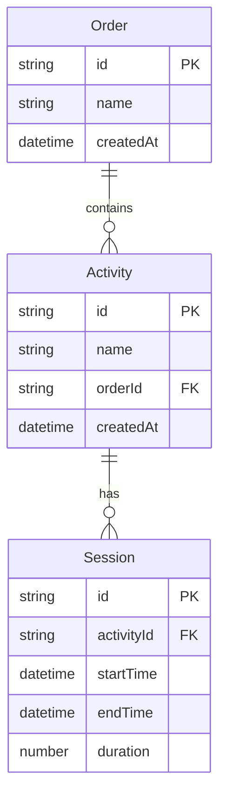

# 設計文書

## 概要

作業時間記録ツールは、HTML、CSS、JavaScriptを使用したシングルページアプリケーション（SPA）として実装します。ブラウザのローカルストレージを使用してデータを永続化し、サーバーレスで動作する軽量なツールです。

## アーキテクチャ

### 技術スタック
- **フロントエンド**: HTML5、CSS3、Vanilla JavaScript（ES6+）
- **データ保存**: ブラウザのLocalStorage API
- **UI フレームワーク**: なし（軽量化のため）
- **ビルドツール**: なし（単一HTMLファイルで完結）

### アーキテクチャパターン
- **MVC パターン**: Model（データ管理）、View（UI表示）、Controller（イベント処理）
- **モジュール分割**: 機能別にJavaScriptクラスを分離
- **イベント駆動**: ユーザーアクションに基づく状態変更

## コンポーネントとインターフェース

### 1. データモデル（Model）

#### OrderModel
```javascript
class Order {
  constructor(id, name, createdAt) {
    this.id = id;
    this.name = name;
    this.createdAt = createdAt;
    this.activities = [];
  }
}
```

#### ActivityModel
```javascript
class Activity {
  constructor(id, name, orderId, createdAt) {
    this.id = id;
    this.name = name;
    this.orderId = orderId;
    this.createdAt = createdAt;
    this.sessions = [];
  }
}
```

#### SessionModel
```javascript
class Session {
  constructor(id, activityId, startTime, endTime = null) {
    this.id = id;
    this.activityId = activityId;
    this.startTime = startTime;
    this.endTime = endTime;
    this.duration = 0; // ミリ秒
  }
}
```

### 2. データ管理層（Repository）

#### StorageManager
- ローカルストレージへのデータ保存・読み込み
- データの整合性チェック
- バックアップとリストア機能

#### DataRepository
- オーダー、アクティビティ、セッションのCRUD操作
- データの検索とフィルタリング
- 集計計算

### 3. ビジネスロジック層（Service）

#### TimerService
- 作業時間の計測管理
- セッションの開始・停止・切り替え
- リアルタイム表示の更新

#### ReportService
- 時間集計の計算
- 期間別レポートの生成
- データエクスポート機能

### 4. プレゼンテーション層（View/Controller）

#### MainController
- アプリケーション全体の制御
- 画面遷移の管理
- イベントハンドリング

#### UIComponents
- OrderListComponent: オーダー一覧表示
- ActivityGridComponent: アクティビティボタン表示
- TimerDisplayComponent: 現在の作業時間表示
- ReportComponent: 集計結果表示

## データモデル

### ローカルストレージ構造
```json
{
  "workTimeTracker": {
    "orders": [
      {
        "id": "order_1",
        "name": "プロジェクトA",
        "createdAt": "2024-01-01T00:00:00Z"
      }
    ],
    "activities": [
      {
        "id": "activity_1",
        "name": "要件定義",
        "orderId": "order_1",
        "createdAt": "2024-01-01T00:00:00Z"
      }
    ],
    "sessions": [
      {
        "id": "session_1",
        "activityId": "activity_1",
        "startTime": "2024-01-01T09:00:00Z",
        "endTime": "2024-01-01T10:30:00Z",
        "duration": 5400000
      }
    ],
    "currentSession": {
      "activityId": "activity_1",
      "startTime": "2024-01-01T14:00:00Z"
    }
  }
}
```

### データ関係


## エラーハンドリング

### エラー種別
1. **データ保存エラー**: ローカルストレージの容量不足
2. **データ破損エラー**: 不正なJSONデータ
3. **タイマーエラー**: 重複セッションの検出
4. **バリデーションエラー**: 入力値の検証失敗

### エラー処理戦略
- **グレースフルデグラデーション**: エラー時も基本機能は継続
- **ユーザーフレンドリーメッセージ**: 技術的詳細を隠した分かりやすいエラー表示
- **自動復旧**: 可能な場合はデータの自動修復を試行
- **ログ記録**: デバッグ用のエラーログをコンソールに出力

## テスト戦略

### 単体テスト
- データモデルの検証
- ストレージ操作の確認
- 時間計算ロジックの検証

### 統合テスト
- UI操作からデータ保存までの一連の流れ
- タイマー機能の動作確認
- データエクスポート機能の検証

### ユーザビリティテスト
- 直感的な操作性の確認
- レスポンシブデザインの動作確認
- アクセシビリティの検証

### パフォーマンステスト
- 大量データでの動作確認
- メモリ使用量の監視
- ローカルストレージ容量の管理

### 5. データ管理機能（Reset）

#### ResetService
- 作業履歴のみのリセット機能
- 全データのリセット機能
- リセット前の確認ダイアログ表示
- データ削除の安全性確保

## エクスポート機能

### エクスポート形式
1. **作業履歴CSV**: 全セッションの詳細データ
2. **集計サマリーCSV**: オーダー別作業時間集計
3. **印刷用レポート**: ブラウザ印刷機能対応

### CSVフォーマット
```csv
日付,開始時刻,終了時刻,オーダー,アクティビティ,作業時間,作業時間（分）
2024-01-01,09:00:00,10:30:00,プロジェクトA,要件定義,01:30:00,90
```

## リセット機能設計

### 履歴リセット
- **対象**: 作業セッションデータのみ
- **保持**: オーダーとアクティビティ構造
- **用途**: 新しい期間での作業記録開始

### 全リセット
- **対象**: 全てのデータ（オーダー、アクティビティ、セッション）
- **結果**: アプリケーションの完全初期化
- **用途**: 新しいプロジェクトでの利用開始

### 安全機能
- 削除対象データの詳細表示
- 確認チェックボックスによる同意確認
- 取り消し不可の警告表示
- エクスポート推奨メッセージ

## UI/UX設計

### レイアウト構成
```
┌─────────────────────────────────────┐
│ ヘッダー（タイトル・設定）           │
├─────────────────────────────────────┤
│ オーダー選択エリア                   │
├─────────────────────────────────────┤
│ アクティビティボタンエリア           │
│ [活動1] [活動2] [活動3] [+新規]      │
├─────────────────────────────────────┤
│ 現在の作業表示・作業終了ボタン       │
│ 作業中: 活動1 (00:15:30) [終了]     │
├─────────────────────────────────────┤
│ レポート・操作ボタンエリア           │
│ [履歴] [エクスポート] [履歴リセット] [全リセット] │
├─────────────────────────────────────┤
│ 集計・レポート表示エリア             │
└─────────────────────────────────────┘
```

### カラーパレット
- **プライマリ**: #2563eb（青）- アクティブな要素
- **セカンダリ**: #64748b（グレー）- 非アクティブな要素
- **アクセント**: #10b981（緑）- 作業中の状態
- **警告**: #ffc107（黄）- 履歴リセット機能
- **危険**: #dc3545（赤）- 全リセット機能
- **情報**: #17a2b8（水色）- 情報表示

### ボタン設計
- **履歴リセット**: 黄色背景で注意喚起
- **全リセット**: 赤色背景で危険性を強調
- **エクスポート**: グレー背景で安全な操作を示す
- **作業開始**: 青色背景でメイン機能を強調

### レスポンシブデザイン
- **デスクトップ**: 3カラムレイアウト
- **タブレット**: 2カラムレイアウト
- **モバイル**: 1カラムレイアウト（縦積み）

### モーダルダイアログ設計
- **確認ダイアログ**: 重要な操作前の確認
- **フォームダイアログ**: オーダー・アクティビティの作成・編集
- **エクスポートメニュー**: エクスポート形式の選択
- **リセット確認**: 削除対象の詳細表示と同意確認